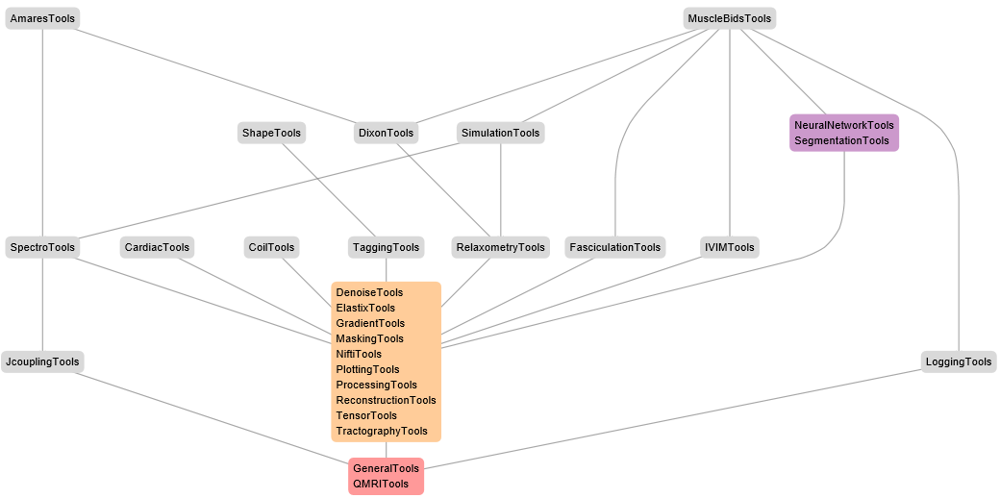
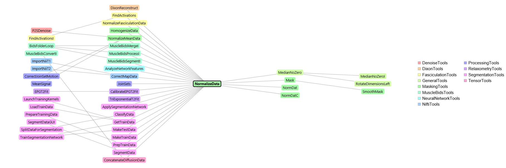
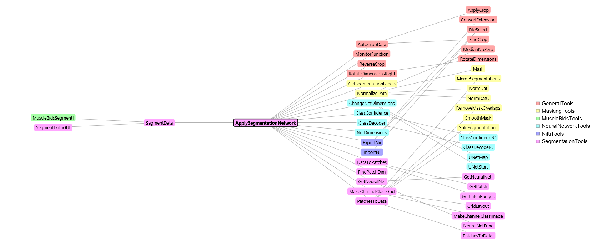
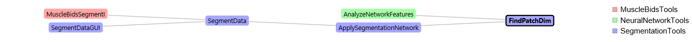

# CodeGraph

Static call graph for Wolfram Language paclets. CodeGraph parses `.wl` and `.m` source with
[CodeParser](https://github.com/WolframResearch/codeparser) and never evaluates it. It finds every definition, which functions call which, and how
packages depend on each other. Use it to see what a change affects, which functions matter most, and where the dependency
cycles are.



*The packages of [QMRITools](https://github.com/mfroeling/QMRITools), a paclet of about 30 packages, from
`PackageGraph[cg, "Condensed"]`. Packages at the top call the ones below. The red box is a group of 10 packages that all
depend on each other (a dependency cycle), and the orange box is a second, smaller cycle.*

## Requirements

- Mathematica or the free [Wolfram Engine](https://www.wolfram.com/engine/), version 13 or later (tested with 15.0).
  CodeParser is included.
- `wolframscript` for the command line. It comes with both.

Nothing else is needed. No server and no MCP: agents only run `wolframscript` and read the text files it writes.

## Installation

Install the latest release from GitHub:

```wl
ResourceFunction["GitHubInstall"]["mfroeling", "CodeGraph"]
```

Or install a specific version from the [releases](https://github.com/mfroeling/CodeGraph/releases) page:

```wl
PacletInstall["https://github.com/mfroeling/CodeGraph/releases/download/0.1.1/CodeGraph-0.1.1.paclet"]
```

For the command line, clone the repository and use `CodeGraph/Scripts/codegraph.wls`. It loads the paclet from the
clone, so nothing has to be installed.

## Use in a notebook

```wl
Needs["CodeGraph`"]  (* or PacletDirectoryLoad["<clone>/CodeGraph"] first when working from a clone *)

cg = BuildCodeGraph["<paclet>/Kernel"];
CodeGraphSummary[cg]                        (* counts, cyclic package groups, private symbols without callers *)

PackageGraph[cg]                            (* layered: callers on top, foundation at the bottom, cycles in color *)
PackageGraph[cg, "Condensed"]               (* each cycle as one box, only edges not implied by a longer path *)

SymbolGraph[cg, "MyFunction"]               (* callers left, callees right *)
SymbolGraph[cg, "MyFunction", 3, "In"]      (* everything reaching MyFunction within 3 steps; "In", "Out" or "Both" *)
```

Hover a box to see its package, file and line. Click it to open the file.

`SymbolGraph` puts callers on the left and callees on the right. Each column is one step further from the function, and
boxes are colored by package. The shape of the picture already tells you something. `NormalizeData` in QMRITools is
heavy on the left: a basic function that many others call, so changing it affects a lot of code.



`ApplySegmentationNetwork` is heavy on the right: a high-level function with a single route into it that relies on a
lot of code underneath. Changing it affects one pipeline, but it can break when anything below it changes.



With `"In"` it shows only what leads to a function. Here is every route to `FindPatchDim` within three steps:



## Use from the command line (for coding agents)

```shell
wolframscript -file CodeGraph/Scripts/codegraph.wls <sourceDir> <outDir>
```

This writes three files:

- `overview.md`: package layers, dependency cycles, the most used functions and private functions without callers. An
  agent can read this short file at the start of a session to learn the structure of the code.
- `defs.tsv`: `symbol, package, line, public, file`
- `edges.tsv`: `caller, callerPackage, line, callee, calleePackage`

Query a graph that has already been built, following callers or callees for several steps:

```shell
wolframscript -file CodeGraph/Scripts/codegraph.wls <outDir> callers NormDat 2
```

```text
callers of NormDat (MaskingTools, SegmentationTools), 2 step(s), 22 functions
step  function        package            defined                   calls
1     NormalizeData   MaskingTools       MaskingTools.wl:191       NormDat
2     SegmentData     SegmentationTools  SegmentationTools.wl:895  NormalizeData
...
```

The output is tab-separated. In a notebook, `CodeGraphQuery[cg, "callees", "f", n]` gives the same output, and
`CodeGraphOverview[cg]` gives the overview. `ImportCodeGraph[outDir]` loads the files back for the views.

## Working with coding agents

An agent starts each session knowing nothing about your code, and it won't find CodeGraph by itself. Point it to
CodeGraph in the instructions file it reads at startup (`AGENTS.md`, `CLAUDE.md` or similar), for example:

```markdown
- **Call graph**: `wolframscript -file <CodeGraph>/Scripts/codegraph.wls <Kernel> <graphDir>` builds it (static, nothing
  is evaluated).
  - Read `<graphDir>/overview.md` when work spans packages.
  - Before changing a function, run `codegraph.wls <graphDir> callers <name> 2`.
  - Rebuild only when the files are missing, when finishing a feature that adds, removes or moves definitions, or when
    asked.
```

This is an instruction, not a rule the agent is forced to follow. Nothing makes the agent run the query, so if it
changes a widely used function without checking the callers, remind it.

**Where it helps:**

- Changing a function that many others call: the query lists every caller, with file and line, across several steps.
- Renaming, moving or deleting a function.
- Starting work in an unfamiliar part of the code: the overview shows what depends on what.

**Where it adds little:**

- Small edits inside one function.
- Questions about what code *does*, such as data layouts, units or algorithms. The graph only knows who calls whom.
- Anything that depends on runtime behaviour. Run the code for that.

The graph is only as current as its last build. Building takes seconds to about half a minute, depending on the paclet
size, so rebuild at milestones, not after every edit.

## How packages are found

- A package is the context from `BeginPackage` or `Package`, so several packages in one file and one package over
  several files are both handled. Code outside any package counts as a package named after its file.
- A symbol is public when it appears in the public section (before `Begin["`Private`"]`) or in `PackageExport`.
- A call to a symbol with a full context (`` Pkg`Private`f ``) goes to that package. Otherwise it goes to the caller's own
  package first, then to the package that exports the symbol.
- Pattern names, `Block`/`Module`/`With` variables and iterators are not counted as calls.
- Files without a context of their own, which a loader usually pulls in with `Get`, are grouped per folder. Their
  definitions are public when a public section or `PacletInfo` declares them, for example as ``"Pkg`f"``.
- A "call" is any use of a defined symbol inside a definition, so a data head used in patterns counts as well.

## Limits

- Calls built at runtime (`ToExpression`, `Symbol["..."]`) and code sent to other kernels as data are not seen.
- Callers outside the parsed folder, such as notebooks or other paclets, are not seen. So "uncalled" only means
  nothing *in this source* calls it.
- Package labels are the last part of the context (`` MyPaclet`Utils` `` becomes `Utils`) unless two contexts share it.

## License

MIT, see [LICENSE](LICENSE).

## Tests

```shell
wolframscript -file Tests/test.wls
```
